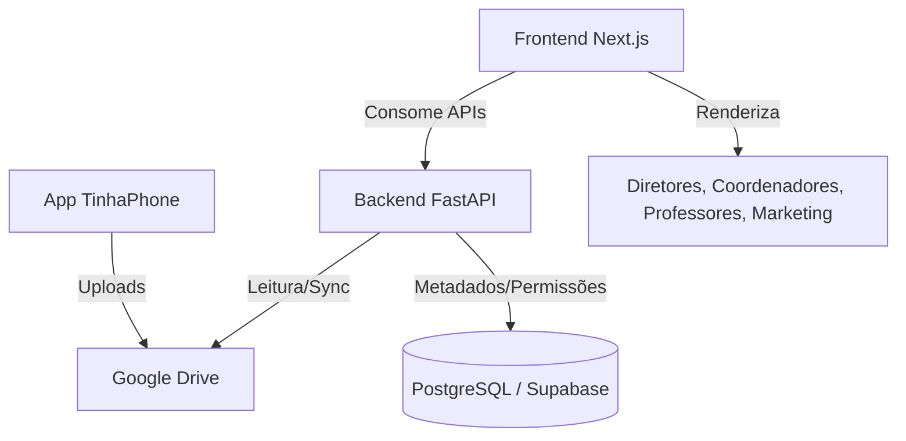

# Plano de Desenvolvimento: Portal Web para Galeria Escolar (Next.js + Python)

Este documento descreve as especificações e o **passo a passo em forma de prompts modulares** para criar um portal web focado em educação infantil. O objetivo do portal é expor e organizar as fotos tiradas pelo aplicativo **TinhaPhone** (salvas no Google Drive) com separação por turmas e níveis de acesso (RBAC - Role-Based Access Control).

---

## 🛠️ Arquitetura Proposta



### Tecnologias Escolhidas:
* **Backend:** Python com **FastAPI** (rápido, tipagem forte, documentação automática).
* **Banco de Dados:** **PostgreSQL** (perfeito para RBAC relacional, ex: Supabase ou Neon).
* **Frontend:** **Next.js** (App Router) + **TailwindCSS** hospedado na **Vercel**.
* **Integração:** Google Drive API (via conta de serviço) para obter as imagens de forma segura.

---

## 📋 Regras de Permissão (Roles e LGPD)

| Role | Acesso a Turmas | Ações Permitidas | Visualiza Fotos p/ Marketing? |
| :--- | :--- | :--- | :--- |
| **Diretor / Coordenador** | Todas as turmas | CRUD de turmas, alunos, usuários e aprovação de fotos. | Sim (todas) |
| **Professor** | Apenas as turmas atribuídas | Upload de fotos, vincular alunos nas fotos, solicitar aprovação. | Apenas das suas turmas |
| **Marketing** | Todas as turmas | Download e visualização **apenas** de fotos marcadas como "Aprovado para Marketing". | **Apenas aprovadas** |

---

# 🚀 Prompts Modulares para Geração do Código

Copie e cole cada bloco abaixo separadamente no chat da sua IA de desenvolvimento para construir o projeto de forma iterativa e segura.

---

## 🔑 Parte 1: Setup do Backend, Banco de Dados (PostgreSQL) e Autenticação (JWT)

> **Contexto para a IA:** Você está criando o backend de um portal escolar em FastAPI. Este portal gerenciará fotos de alunos armazenadas no Google Drive. Precisamos configurar o banco de dados PostgreSQL usando SQLAlchemy e implementar a autenticação JWT.

### Prompt para a IA:
```text
Crie a estrutura inicial de um backend em Python usando FastAPI, SQLAlchemy (para PostgreSQL) e JWT para autenticação.

Precisamos dos seguintes componentes desenvolvidos nesta parte:

1. Configuração do banco de dados (db.py) com pool de conexões.
2. Modelos de tabelas no SQLAlchemy (models.py):
   - Users: id, name, email, hashed_password, role (Enum: ADMIN, DIRETOR, COORDENADOR, PROFESSOR, MARKETING), created_at.
   - Classes (Turmas): id, name, year, created_at.
   - UserClassLink (Relação muitos-para-muitos entre Professores e Turmas).
   - Students: id, name, class_id, status (Ativo/Inativo), marketing_allowed (Boolean - autorização de uso de imagem pelos pais).
   - Photos: id, file_id (ID do arquivo local / UUID), title, description, uploaded_by_user_id, class_id, status (Enum: PENDING_REVIEW, APPROVED_FOR_MARKETING, PRIVATE_SCHOOL_ONLY), created_at.
   - PhotoStudentLink (Vínculo de quais alunos aparecem na foto).

3. Esquemas do Pydantic (schemas.py) para validação de entrada/saída (UserCreate, UserResponse, Token, etc.).
4. Lógica de hash de senha e utilitários JWT (security.py) usando a biblioteca passlib e python-jose.
5. Endpoints de autenticação (auth.py) para /api/auth/register e /api/auth/login.

Gere apenas estes arquivos de infraestrutura e autenticação agora, com tratamento de erros limpo e estruturado.
```

---

## 📂 Parte 2: Upload Direto de Fotos e Armazenamento Local

> **Contexto para a IA:** Agora que temos o banco de dados estruturado, precisamos de uma API para que os usuários façam upload de fotos diretamente para o backend. O backend deve armazenar os arquivos de imagem localmente e registrar os metadados no banco de dados.

### Prompt para a IA:
```text
Com base no projeto FastAPI anterior, crie um serviço de gerenciamento de fotos local (photo_service.py) e os endpoints correspondentes.

O serviço deve implementar as seguintes funcionalidades:

1. Função `save_photo(file: UploadFile, session: Session, user_id: int, class_id: int = None)` que:
   - Valide se o arquivo é uma imagem (.jpg, .jpeg, .png).
   - Salve o arquivo em um diretório local (`uploads/`) usando um nome único (UUID).
   - Insira um registro na tabela 'photos' com o status 'PENDING_REVIEW', o nome/caminho do arquivo salvo (file_id) e o ID do usuário que fez o upload.
2. Função `get_photo_path(file_id: str)` que:
   - Retorna o caminho absoluto do arquivo no sistema para renderização.

Crie também os endpoints em FastAPI:
- `POST /api/photos/upload`: Recebe a foto, o ID da turma (opcional) e o usuário autenticado (através do JWT) para salvar a foto.
- `GET /api/photos/stream/{file_id}`: Retorna o arquivo de imagem diretamente como uma resposta do tipo arquivo (`FileResponse`).
```

---

## 👥 Parte 3: APIs de Regras de Acesso (RBAC), Turmas e Vínculo de Alunos

> **Contexto para a IA:** Precisamos implementar as APIs de gerenciamento de turmas, alunos e os endpoints de fotos. Estes endpoints devem respeitar estritamente o nível de acesso (Role) do usuário logado obtido através do JWT.

### Prompt para a IA:
```text
Crie os endpoints de negócios no FastAPI protegidos por autenticação JWT e regras de acesso por Role (RBAC):

1. Dependency Injection (`get_current_active_user` e `require_roles(allowed_roles: list)`):
   - Extrai o token JWT, valida o usuário e garante que o usuário possui uma das roles autorizadas.

2. Endpoints de Turmas (`/api/classes`):
   - GET /: Retorna todas as turmas (Apenas ADMIN, DIRETOR, COORDENADOR). Para PROFESSOR, retorna apenas as turmas associadas a ele no link 'UserClassLink'.
   - POST /: Cria uma nova turma (ADMIN, DIRETOR, COORDENADOR).

3. Endpoints de Alunos (`/api/students`):
   - GET /class/{class_id}: Retorna os alunos daquela turma.
   - POST /: Cria aluno vinculado a uma turma (ADMIN, DIRETOR, COORDENADOR, PROFESSOR).

4. Endpoints de Fotos (`/api/photos`):
   - GET /class/{class_id}: Retorna fotos da turma. Se o usuário for PROFESSOR, valida se ele dá aula nessa turma. Se for MARKETING, retorna apenas se as fotos tiverem status 'APPROVED_FOR_MARKETING'.
   - PUT /{photo_id}/status: Altera o status da foto (Ex: Aprovar para Marketing). Apenas ADMIN, DIRETOR, COORDENADOR podem aprovar.
   - POST /{photo_id}/tag-students: Associa uma lista de IDs de alunos (Student) a essa foto.

Garanta tratamento de exceções HTTP 403 Forbidden para acessos não autorizados.
```

---

## 🎨 Parte 4: Frontend Next.js - Configuração, Login e Dashboard com RBAC

> **Contexto para a IA:** Agora passamos para o frontend. Usaremos Next.js (App Router), Tailwind CSS e TypeScript. Faremos a autenticação e a tela inicial que exibe as turmas conforme a role do usuário.

### Prompt para a IA:
```text
Crie a estrutura inicial de um projeto Next.js (App Router, TypeScript, Tailwind CSS) focado no consumo da API do portal escolar.

Desenvolva os seguintes itens:

1. Gerenciador de estado de autenticação (authContext.tsx ou similar) que:
   - Armazena o token JWT no localStorage/cookies de forma segura.
   - Salva os dados básicos do usuário logado (nome, email, role).
   - Oferece rotas protegidas usando Next.js Middleware.

2. Página de Login (app/login/page.tsx):
   - Design moderno com Tailwind CSS (estilo limpo, focado em usabilidade, com cores suaves e responsivo).
   - Validação simples de formulário de login integrado à API do FastAPI.

3. Dashboard Principal (app/page.tsx):
   - Carrega as turmas (Classes) permitidas do usuário logado.
   - Se for MARKETING: Exibe uma visão consolidada de todas as fotos aprovadas em vez de turmas, ou um atalho direto para a biblioteca do marketing.
   - Se for PROFESSOR: Exibe os cards apenas das suas turmas atribuídas.
   - Se for DIRETOR/COORDENADOR: Exibe uma barra lateral administrativa (para gerenciar turmas, professores e ver logs de erros se necessário).

Use layouts limpos, fontes modernas (Inter ou Outfit) e estados de carregamento (Skeleton loaders) para uma experiência premium.
```

---

## 🖼️ Parte 5: Galeria de Fotos da Turma, Marcação de Alunos e Área do Marketing

> **Contexto para a IA:** O último passo é construir a galeria de imagens de cada turma, onde as fotos enviadas aparecem, o modal para visualizar a foto em tamanho maior, marcar alunos e o filtro avançado do Marketing.

### Prompt para a IA:
```text
No projeto Next.js anterior, crie a página de galeria da turma (app/class/[id]/page.tsx) e a área do Marketing (app/marketing/page.tsx):

1. Página de Galeria da Turma:
   - Grid de imagens com scroll infinito ou paginação eficiente.
   - Cada imagem deve puxar a rota de stream do backend FastAPI (`/api/photos/stream/{file_id}`).
   - Badge na imagem exibindo o status atual (Pendente de Revisão, Aprovada para Marketing, Privada da Escola).

2. Modal Detalhado de Imagem:
   - Abre ao clicar em uma foto na galeria.
   - Exibe a foto em alta qualidade.
   - Permite vincular alunos da turma na foto (Multi-select integrado ao endpoint `/tag-students`).
   - Botões de ação rápida para aprovação de uso de imagem: "Liberar para Marketing" (Visível apenas para Direção/Coordenação).
   - Alerta visual caso algum aluno marcado na foto NÃO tenha a autorização dos pais para marketing (`marketing_allowed = false`), desativando o botão de liberação para proteger a escola juridicamente.

3. Página do Marketing (app/marketing/page.tsx):
   - Exibe apenas fotos aprovadas de todas as turmas.
   - Filtros de busca por Turma e por nome de Aluno.
   - Opção de download direto da imagem em alta resolução.

Crie interfaces polidas usando Tailwind, ícones do lucide-react e transições suaves.
```
